# HandyMan

An android application that provides an all-in-one platform for customers to hire service providers, from carpenters to technicians and beauticians. HandyMan also provides service providers opportunities to freelance with customers. 

## Description

Two different modes for users to create their account: 

1. Customer Mode

      Customers can hire service providers among different categories and schedule an appointment with the favorable service provider. Customers and Service Providers can interact through an in-built chat feature. 

   Once the task is completed by the service provider, the customer can rate and review the service provider.

2. Service Provider Mode

   Service Provider can see the list of all active, pending and completed tasks. The service provider can either accept or reject a task from pending tab. Once a task is accepted it moves to active tab and further moves to completed tab after completion of task.

   The service provider can get the directions to the customer's location, can discuss about the task with customer in the chat fragment and even make a call to the customer. 

## Screenshots
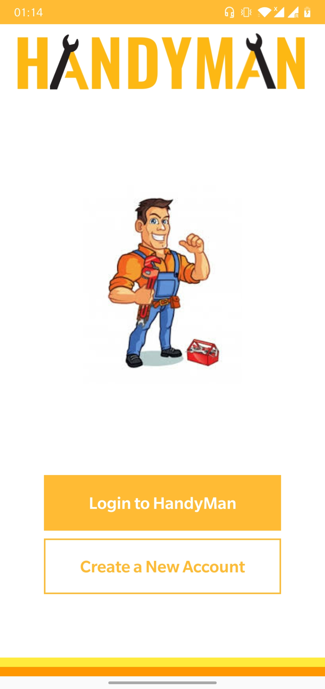   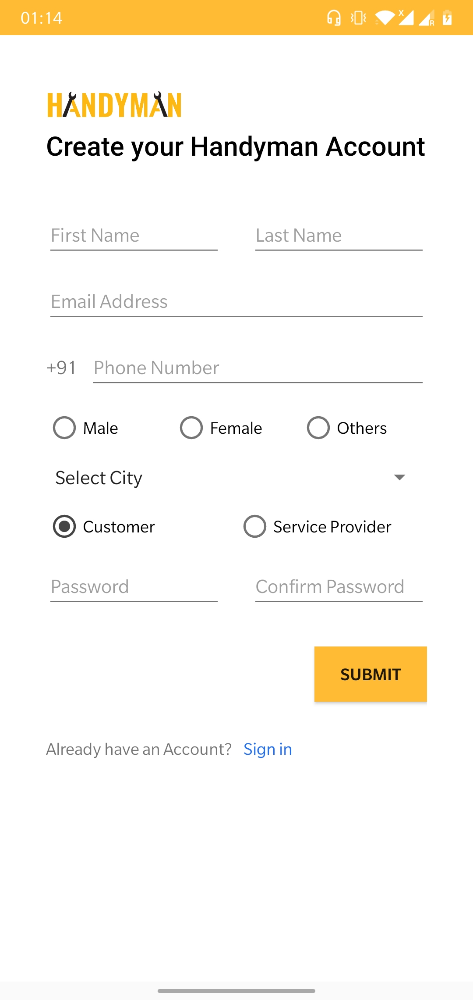   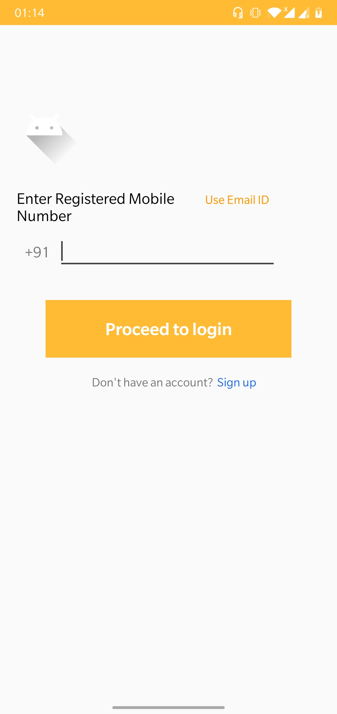   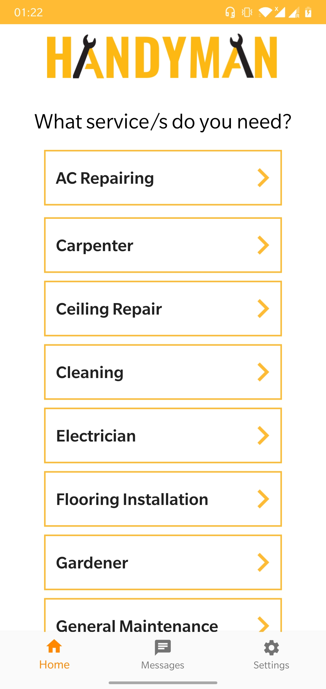   
   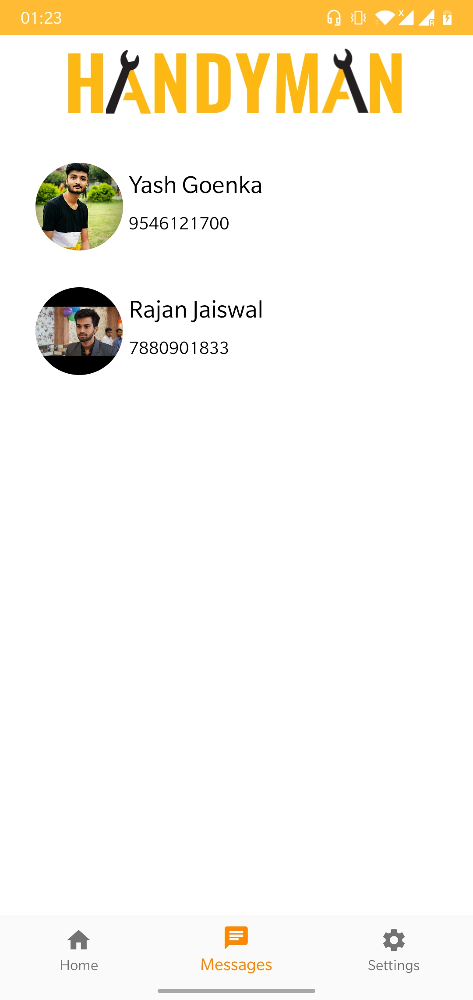   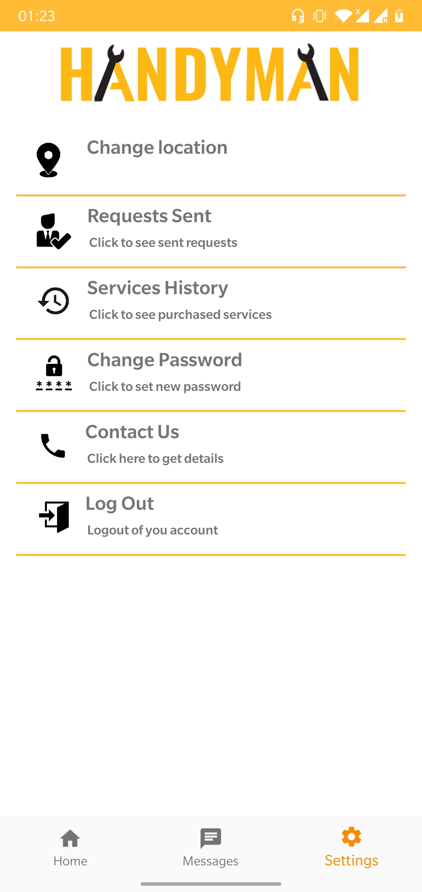   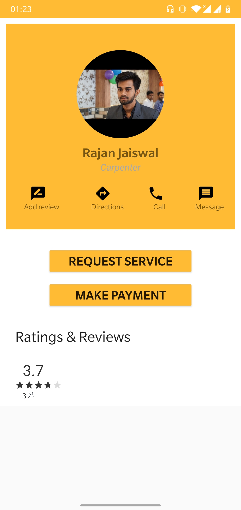   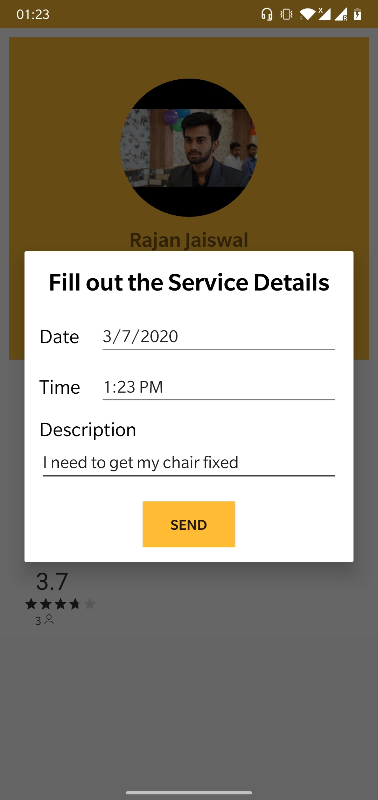   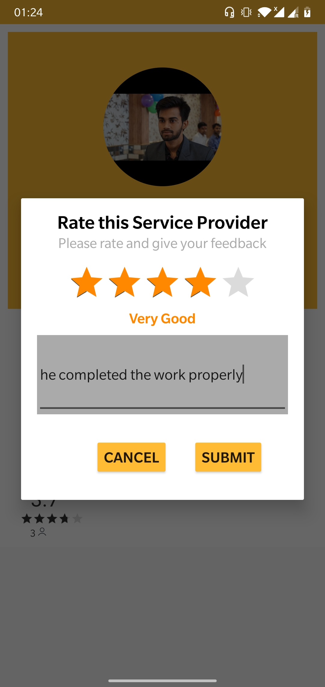   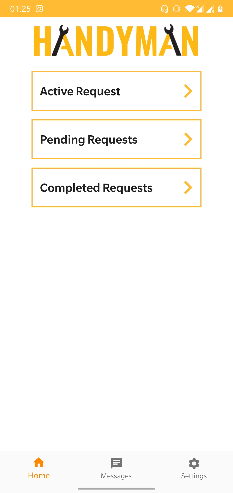
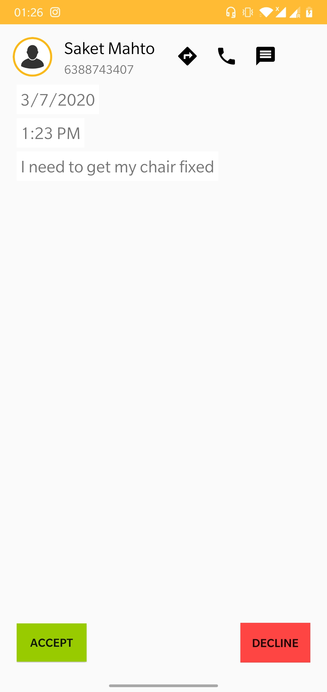   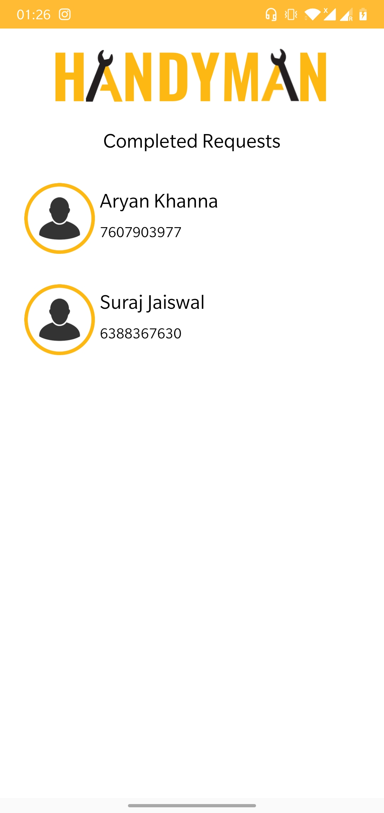
## Contributing
Pull requests are welcome. For major changes, please open an issue first to discuss what you would like to change.

Please make sure to update tests as appropriate.

## License
MIT License

Copyright (c) 2020 Lokesh Raj Singhi, Saket Mahto, Yash Goenka
